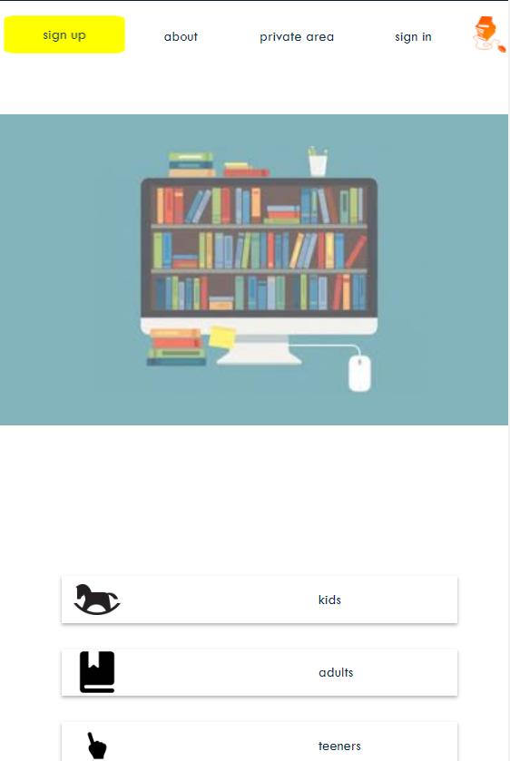

# FrontEnd-projects
5 frontend projects with JavaScripts and React

### Project 1
Developing a virtual library which serves far readers

screen-shot

### Project 2
Blokus strategy game - vanilla js. Can you be smarter than the computer?

screen-shot

### Project 3
A demo server which can handle fake Ajax requests to serve a Single Page Application of a todo list database.

screen-shot

