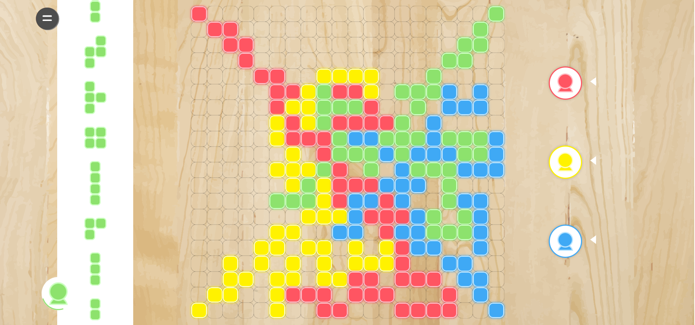

# FrontEnd-projects
5 frontend projects with JavaScripts and React

### Project 1
A static responsive HTML and CSS virtual library.

screen-shot

### Project 2
Blokus strategy game - vanilla js. Play against the smart computer in an interesting, easy-to-use and butiful game.

screen-shot

### Project 3
A demo server which can handle fake Ajax requests to serve a Single Page Application of a todo list database.

screen-shot

